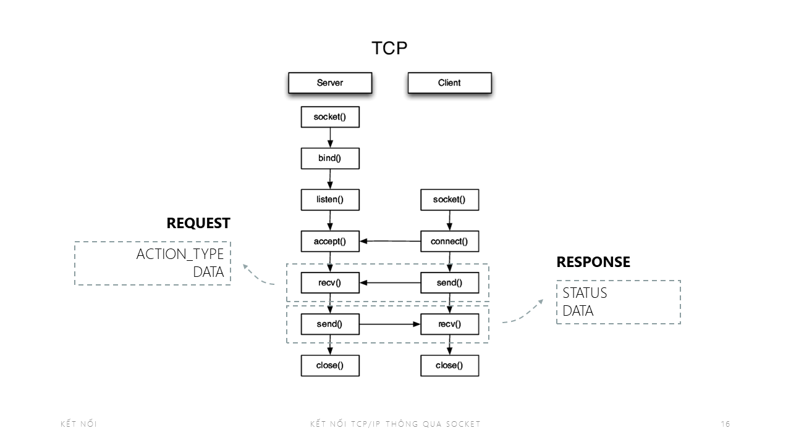

# Voting-System

The application helping public voting.

## Project Component

.NET framework 4.8

Entity Framework

## System Design

_
System flow diagram
_

_
 Client Application
_

_
 MVC Structure
_

_
 Database Design
_

_
 Communication
_
